## 광고 분류 모델을 도입한 커뮤니티 웹 서비스<br>_Community Web Services with Ad Classification Model
<p> 
 


</p>
<hr>

## 📑 프로젝트 개요
- 언택트 소비가 활성화되면서 더욱 많은 소비자들이 상품평이나 구매 후기 등에 의존하게 되고, 이에 따라 기업들은 구매후기 작성에 따른 혜택을 늘려가고 있다. <br>
- 광고 기술, 즉 애드테크(Ad-tech)가 발전함에 따라 다양한 유형의 새로운 광고들이 이용자가 추구하는 정보/콘텐츠와 구별되지 않기 때문에 이용자들은 어려움을 겪고 있다.
- 본 프로젝트의 목표는 KoBERT를 이용해 광고 분류 모델을 도입한 커뮤니티 웹 서비스를 구현하는 것이다.
<br>

## 📋 시스템구성 및 기능
### [ 시스템 구조 ] <br>
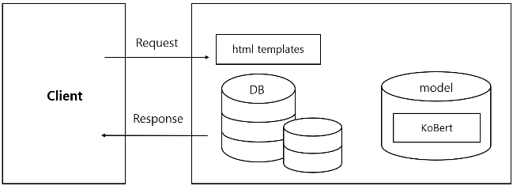

### [ 데이터베이스 구조 ] <br>
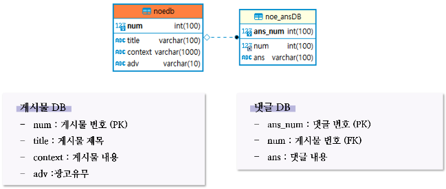

### [ 동작 시나리오 ] <br>
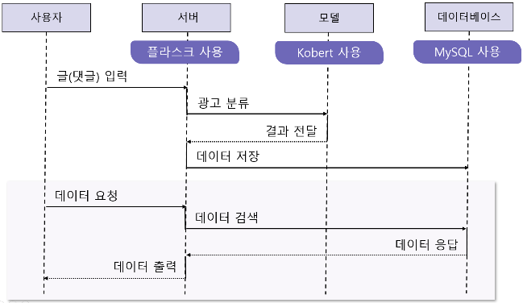

### [ 모델 학습 결과 ]  그래프 : 에포크에 따른 학습 및 테스트셋의 정확도  <br>
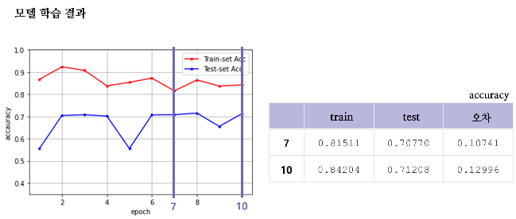

학습 데이터셋의 경우 에포크가 2일 때 가장 높은 점수가 나왔으나, 테스트 데이터셋의 정확도와 큰 차이를 보였다. <br>
에포크가 7의 경우, 학습 데이터셋은 0.81511, 테스트 데이터셋은 0.70770으로 0.10741 오차를 보였다.<br>
또한 에포크 10의 경우에는, 학습 데이터셋 0.84204, 테스트 데이터셋은 0.71208으로 0.12996 오차를 보였다. <br>
따라서 에포크가 7 또는 10일때의 모델을 사용하는 것이 적합하다고 생각해 10까지 학습시킨 모델을 사용하였다.
<br>

## 💻 프로젝트 구현
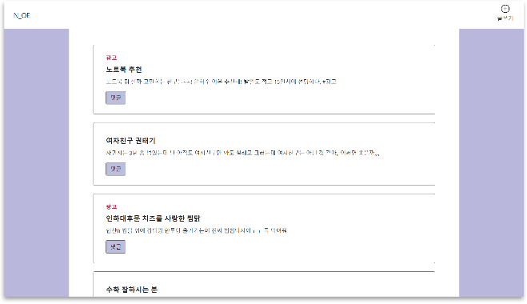
서비스에 접속하면 게시글을 볼 수 있다. 광고 글의 경우 제목 위에 광고 라벨이 표시된다. <br> <br>
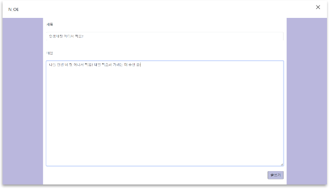
글쓰기 버튼을 눌러 글을 등록할 수 있다. 먼저 일상 글을 입력하였다. <br> <br>
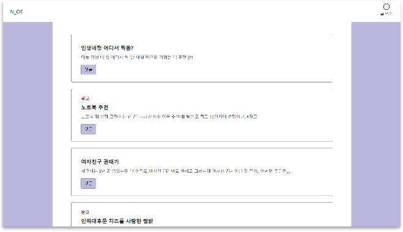
글이 등록된 모습이다. 일상 글이기 때문에 광고 라벨이 없는 것을 확인할 수 있다. <Br> <br>
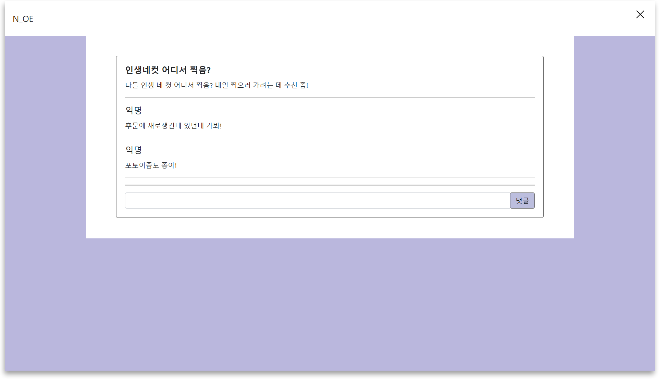
댓글 버튼을 누르면 댓글을 확인 및 등록할 수 있다.<br> <br>
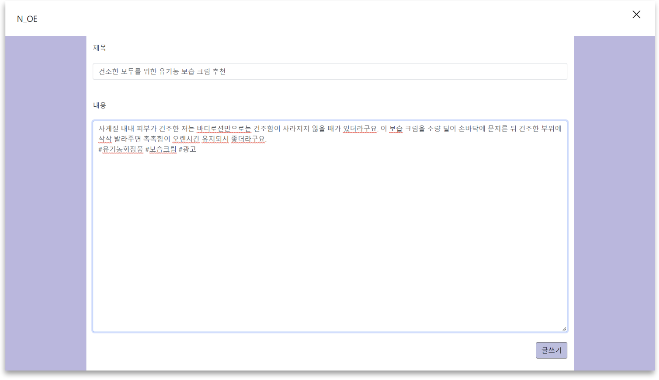
광고성 글을 등록하였다. <br> <br>
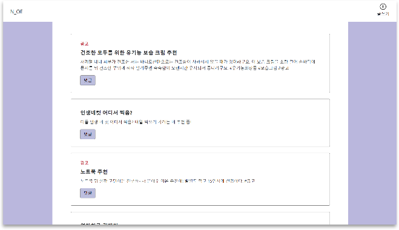
모델이 해당 글을 광고로 분류하였으며, 따라서 제목 위에 광고 라벨이 표시되었다. <br> <br>

### [ 구현 영상 ]


<br>
<hr>

# KoBERT

* [KoBERT](#kobert)
  * [Korean BERT pre-trained cased (KoBERT)](#korean-bert-pre-trained-cased-kobert)
    * [Why'?'](#why)
    * [Training Environment](#training-environment)
    * [Requirements](#requirements)
    * [How to install](#how-to-install)
  * [How to use](#how-to-use)
    * [Using with PyTorch](#using-with-pytorch)
    * [Using with ONNX](#using-with-onnx)
    * [Using with MXNet-Gluon](#using-with-mxnet-gluon)
    * [Tokenizer](#tokenizer)
  * [Subtasks](#subtasks)
    * [Naver Sentiment Analysis](#naver-sentiment-analysis)
    * [KoBERT와 CRF로 만든 한국어 객체명인식기](#kobert와-crf로-만든-한국어-객체명인식기)
    * [Korean Sentence BERT](#korean-sentence-bert)
  * [Release](#release)
  * [Contacts](#contacts)
  * [License](#license)

---

## Korean BERT pre-trained cased (KoBERT)

### Why'?'

* 구글 [BERT base multilingual cased](https://github.com/google-research/bert/blob/master/multilingual.md)의 한국어 성능 한계

### Training Environment

* Architecture

```python
predefined_args = {
        'attention_cell': 'multi_head',
        'num_layers': 12,
        'units': 768,
        'hidden_size': 3072,
        'max_length': 512,
        'num_heads': 12,
        'scaled': True,
        'dropout': 0.1,
        'use_residual': True,
        'embed_size': 768,
        'embed_dropout': 0.1,
        'token_type_vocab_size': 2,
        'word_embed': None,
    }
```

* 학습셋

| 데이터      | 문장 | 단어 |
| ----------- | ---- | ---- |
| 한국어 위키 | 5M   | 54M  |

* 학습 환경
  * V100 GPU x 32, Horovod(with InfiniBand)

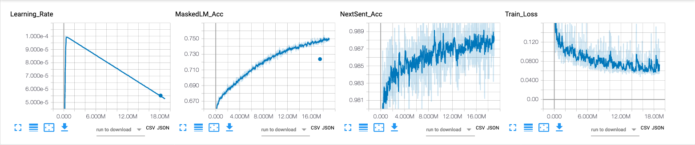

* 사전(Vocabulary)
  * 크기 : 8,002
  * 한글 위키 기반으로 학습한 토크나이저(SentencePiece)
  * Less number of parameters(92M < 110M )

### Requirements

* see [requirements.txt](https://github.com/SKTBrain/KoBERT/blob/master/requirements.txt)

### How to install

* Install KoBERT as a python package

  ```sh
  pip install git+https://git@github.com/SKTBrain/KoBERT.git@master
  ```

* If you want to modify source codes, please clone this repository

  ```sh
  git clone https://github.com/SKTBrain/KoBERT.git
  cd KoBERT
  pip install -r requirements.txt
  ```

---

## How to use

### Using with PyTorch

*Huggingface transformers API가 편하신 분은 [여기](kobert_hf)를 참고하세요.*

```python
>>> import torch
>>> from kobert import get_pytorch_kobert_model
>>> input_ids = torch.LongTensor([[31, 51, 99], [15, 5, 0]])
>>> input_mask = torch.LongTensor([[1, 1, 1], [1, 1, 0]])
>>> token_type_ids = torch.LongTensor([[0, 0, 1], [0, 1, 0]])
>>> model, vocab  = get_pytorch_kobert_model()
>>> sequence_output, pooled_output = model(input_ids, input_mask, token_type_ids)
>>> pooled_output.shape
torch.Size([2, 768])
>>> vocab
Vocab(size=8002, unk="[UNK]", reserved="['[MASK]', '[SEP]', '[CLS]']")
>>> # Last Encoding Layer
>>> sequence_output[0]
tensor([[-0.2461,  0.2428,  0.2590,  ..., -0.4861, -0.0731,  0.0756],
        [-0.2478,  0.2420,  0.2552,  ..., -0.4877, -0.0727,  0.0754],
        [-0.2472,  0.2420,  0.2561,  ..., -0.4874, -0.0733,  0.0765]],
       grad_fn=<SelectBackward>)
```

`model`은 디폴트로 `eval()`모드로 리턴됨, 따라서 학습 용도로 사용시 `model.train()`명령을 통해 학습 모드로 변경할 필요가 있다.

* Naver Sentiment Analysis Fine-Tuning with pytorch
  * Colab에서 [런타임] - [런타임 유형 변경] - 하드웨어 가속기(GPU) 사용을 권장합니다.
  * [](https://colab.research.google.com/github/SKTBrain/KoBERT/blob/master/scripts/NSMC/naver_review_classifications_pytorch_kobert.ipynb)

### Using with ONNX

```python
>>> import onnxruntime
>>> import numpy as np
>>> from kobert import get_onnx_kobert_model
>>> onnx_path = get_onnx_kobert_model()
>>> sess = onnxruntime.InferenceSession(onnx_path)
>>> input_ids = [[31, 51, 99], [15, 5, 0]]
>>> input_mask = [[1, 1, 1], [1, 1, 0]]
>>> token_type_ids = [[0, 0, 1], [0, 1, 0]]
>>> len_seq = len(input_ids[0])
>>> pred_onnx = sess.run(None, {'input_ids':np.array(input_ids),
>>>                             'token_type_ids':np.array(token_type_ids),
>>>                             'input_mask':np.array(input_mask),
>>>                             'position_ids':np.array(range(len_seq))})
>>> # Last Encoding Layer
>>> pred_onnx[-2][0]
array([[-0.24610452,  0.24282141,  0.25895312, ..., -0.48613444,
        -0.07305173,  0.07560554],
       [-0.24783179,  0.24200465,  0.25520486, ..., -0.4877185 ,
        -0.0727044 ,  0.07536091],
       [-0.24721591,  0.24196623,  0.2560626 , ..., -0.48743123,
        -0.07326943,  0.07650235]], dtype=float32)
```

_ONNX 컨버팅은 [soeque1](https://github.com/soeque1)께서 도움을 주셨습니다._

### Using with MXNet-Gluon

```python
>>> import mxnet as mx
>>> from kobert import get_mxnet_kobert_model
>>> input_id = mx.nd.array([[31, 51, 99], [15, 5, 0]])
>>> input_mask = mx.nd.array([[1, 1, 1], [1, 1, 0]])
>>> token_type_ids = mx.nd.array([[0, 0, 1], [0, 1, 0]])
>>> model, vocab = get_mxnet_kobert_model(use_decoder=False, use_classifier=False)
>>> encoder_layer, pooled_output = model(input_id, token_type_ids)
>>> pooled_output.shape
(2, 768)
>>> vocab
Vocab(size=8002, unk="[UNK]", reserved="['[MASK]', '[SEP]', '[CLS]']")
>>> # Last Encoding Layer
>>> encoder_layer[0]
[[-0.24610372  0.24282135  0.2589539  ... -0.48613444 -0.07305248
   0.07560539]
 [-0.24783105  0.242005    0.25520545 ... -0.48771808 -0.07270523
   0.07536077]
 [-0.24721491  0.241966    0.25606337 ... -0.48743105 -0.07327032
   0.07650219]]
<NDArray 3x768 @cpu(0)>
```

* Naver Sentiment Analysis Fine-Tuning with MXNet
  * [](https://colab.research.google.com/github/SKTBrain/KoBERT/blob/master/scripts/NSMC/naver_review_classifications_gluon_kobert.ipynb)

### Tokenizer

* Pretrained [Sentencepiece](https://github.com/google/sentencepiece) tokenizer

```python
>>> from gluonnlp.data import SentencepieceTokenizer
>>> from kobert import get_tokenizer
>>> tok_path = get_tokenizer()
>>> sp  = SentencepieceTokenizer(tok_path)
>>> sp('한국어 모델을 공유합니다.')
['▁한국', '어', '▁모델', '을', '▁공유', '합니다', '.']
```

---

## Subtasks

### Naver Sentiment Analysis

* Dataset : <https://github.com/e9t/nsmc>

| Model                                                                                               | Accuracy                                                        |
| --------------------------------------------------------------------------------------------------- | --------------------------------------------------------------- |
| [BERT base multilingual cased](https://github.com/google-research/bert/blob/master/multilingual.md) | 0.875                                                           |
| KoBERT                                                                                              | **[0.901](logs/bert_naver_small_512_news_simple_20190624.txt)** |
| [KoGPT2](https://github.com/SKT-AI/KoGPT2)                                                          | 0.899                                                           |

### KoBERT와 CRF로 만든 한국어 객체명인식기

* <https://github.com/eagle705/pytorch-bert-crf-ner>

```text
문장을 입력하세요:  SKTBrain에서 KoBERT 모델을 공개해준 덕분에 BERT-CRF 기반 객체명인식기를 쉽게 개발할 수 있었다.
len: 40, input_token:['[CLS]', '▁SK', 'T', 'B', 'ra', 'in', '에서', '▁K', 'o', 'B', 'ER', 'T', '▁모델', '을', '▁공개', '해', '준', '▁덕분에', '▁B', 'ER', 'T', '-', 'C', 'R', 'F', '▁기반', '▁', '객', '체', '명', '인', '식', '기를', '▁쉽게', '▁개발', '할', '▁수', '▁있었다', '.', '[SEP]']
len: 40, pred_ner_tag:['[CLS]', 'B-ORG', 'I-ORG', 'I-ORG', 'I-ORG', 'I-ORG', 'O', 'B-POH', 'I-POH', 'I-POH', 'I-POH', 'I-POH', 'O', 'O', 'O', 'O', 'O', 'O', 'B-POH', 'I-POH', 'I-POH', 'I-POH', 'I-POH', 'I-POH', 'I-POH', 'O', 'O', 'O', 'O', 'O', 'O', 'O', 'O', 'O', 'O', 'O', 'O', 'O', 'O', '[SEP]']
decoding_ner_sentence: [CLS] <SKTBrain:ORG>에서 <KoBERT:POH> 모델을 공개해준 덕분에 <BERT-CRF:POH> 기반 객체명인식기를 쉽게 개발할 수 있었다.[SEP]
```

### Korean Sentence BERT

* <https://github.com/BM-K/KoSentenceBERT-SKT>

|Model|Cosine Pearson|Cosine Spearman|Euclidean Pearson|Euclidean Spearman|Manhattan Pearson|Manhattan Spearman|Dot Pearson|Dot Spearman|
|:------------------------:|:----:|:----:|:----:|:----:|:----:|:----:|:----:|:----:|
|NLl|65.05|68.48|68.81|68.18|68.90|68.20|65.22|66.81|
|STS|**80.42**|**79.64**|**77.93**|77.43|**77.92**|77.44|**76.56**|**75.83**|
|STS + NLI|78.81|78.47|77.68|**77.78**|77.71|**77.83**|75.75|75.22|
---

## Release

* v0.2.3
  * support `onnx 1.8.0`
* v0.2.2
  * fix `No module named 'kobert.utils'`
* v0.2.1
  * guide default 'import statements'
* v0.2
  * download large files from `aws s3`
  * rename functions
* v0.1.2
  * Guaranteed compatibility with higher versions of transformers
  * fix pad token index id
* v0.1.1
  * 사전(vocabulary)과 토크나이저 통합
* v0.1
  * 초기 모델 릴리즈

## Contacts

`KoBERT` 관련 이슈는 [이곳](https://github.com/SKTBrain/KoBERT/issues)에 등록해 주시기 바랍니다.

## License

`KoBERT`는 `Apache-2.0` 라이선스 하에 공개되어 있습니다. 모델 및 코드를 사용할 경우 라이선스 내용을 준수해주세요. 라이선스 전문은 `LICENSE` 파일에서 확인하실 수 있습니다.
